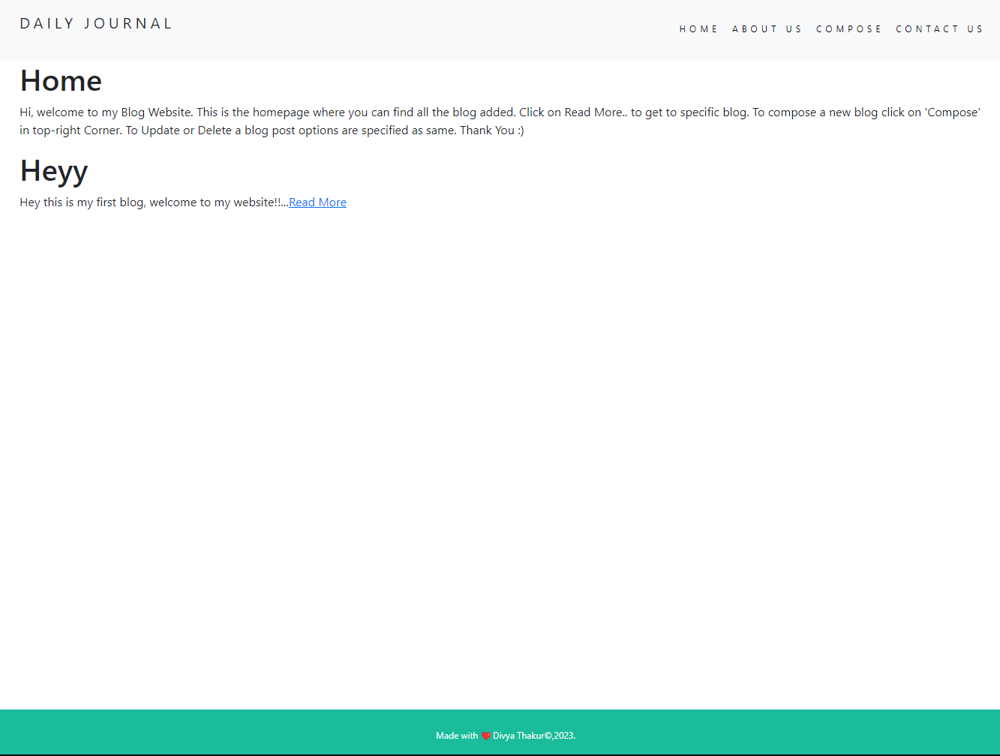
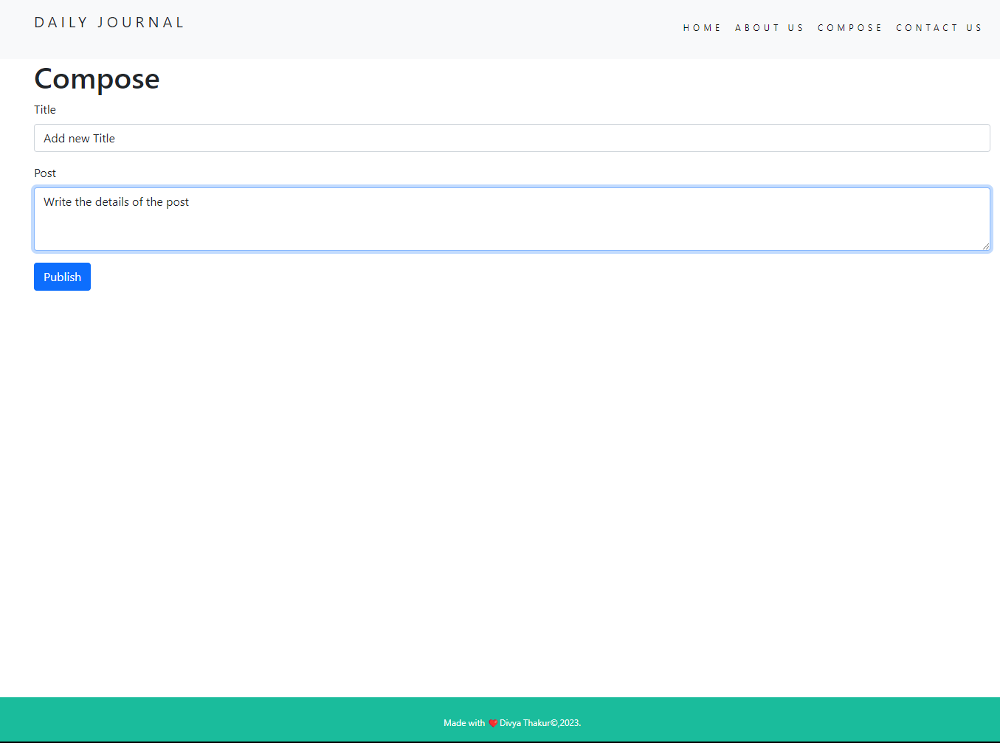

# Daily Journal with Node.js, MongoDB, and EJS Partials

This project is a blog website implemented using Node.js, MongoDB for database storage, and EJS partials for efficient templating. The website allows users to read and create blog posts.

## Features

- User-friendly interface for reading and creating blog posts.
- Utilizes the Express.js framework to handle routing and server logic.
- MongoDB is used for persistent data storage of blog posts.
- EJS partials enable modular templating for consistent design.

## Installation

1. Clone the repository: `git clone https://github.com/Divyaaa02/Blog_Website.git`
2. Navigate to the project directory: `cd blog-website`
3. Install dependencies: `npm install`

## Configuration

1. Create a `.env` file and add the connection url

## Usage

1. Start the server: `npm start`
2. Open your web browser and navigate to `http://localhost:3000` to access the blog website.

## Screenshots

*Screenshot of the home page displaying list of blog posts.*

*Screenshot of the Compose post page.*

## Contributing

Contributions are welcome! Please fork the repository and create a pull request.

## License

This project is licensed under the [MIT License](LICENSE).

---

**Note:** Images are included in this repository for demonstration purposes, as you mentioned you can't host the website. Make sure to replace the images with actual screenshots and content related to your project.

For any additional information or queries, feel free to contact [your-email@example.com](mailto:your-email@example.com).
